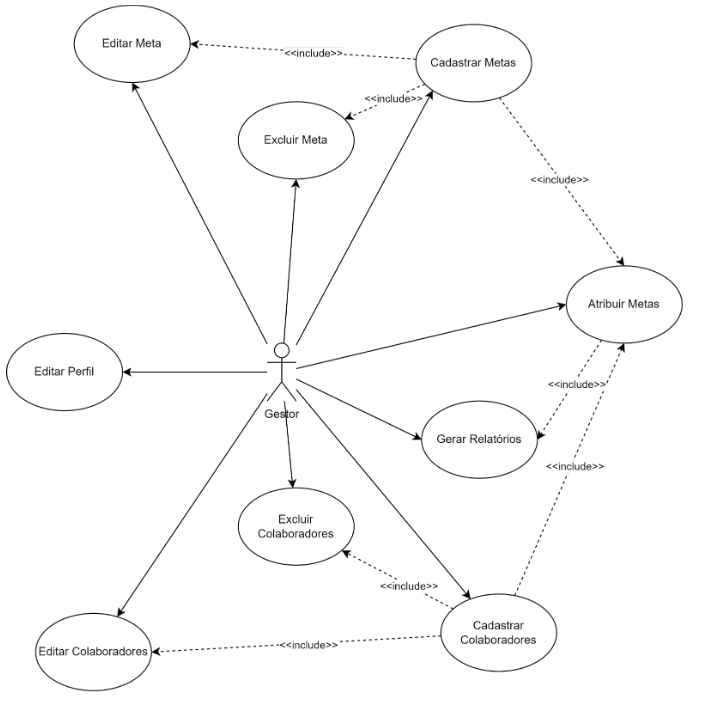

# Sistema de Gestão de Funcionários e Metas (SGFM)

 

## Descrição

O SGFM é uma plataforma digital inovadora desenhada para facilitar a administração corporativa entre gestores e funcionários. Ele tem o objetivo de estruturar, delegar e rastrear metas, oferecendo uma visão integrada do progresso e rendimento da equipe.

### Equipe de Desenvolvimento:
- Davidson Renato Frade
- Paulo Victor Fernandes Sousa
- Diego Dias Pires
- Wallace Barbosa Ferreira

## Tecnologias 

### Backend:
- **Framework**: Django (Python)
- **API**: Django REST Framework
- **Banco de Dados**: MySQL

### Frontend:
- **Framework**: ReactJS

## Funcionalidades Principais

1. Cadastro de Funcionários
2. Cadastro de Metas
3. Atribuição de Metas
4. Acompanhamento de Progresso
5. Relatórios e Análises

## Requisitos

- REQ1: CRUD Metas
- REQ2: CRUD Gestores 
- REQ3: CRUD Colaboradores
- REQ4: Atribuição de Metas pelo gestor a seus colaboradores
- REQ5: Acompanhamento das metas
- REQ6: Relatórios

## Como Rodar o Projeto

1. **Configurando o ambiente**: Adicionar um arquivo chamado local_settings.py no diretorio core com as credenciais da sua base de dados

```python
DEBUG = True
ALLOWED_HOSTS = ['*']
SITE_ID = 1
STATIC_URL = '/static/'
DATABASES = {
    'default': {
        'ENGINE': 'django.db.backends.mysql',
        'NAME': 'nome da sua database',
        'USER': 'seu usuario',
        'PASSWORD': 'sua senha',
        'HOST': 'localhost',
        'PORT': '',
        'TIME_ZONE': 'America/Sao_Paulo',
        'OPTIONS': {
            'charset': 'utf8',
            'use_unicode': True,
        },
    },
}
DATA_UPLOAD_MAX_NUMBER_FIELDS = 10000000
```
2. **Instalando as dependências**: Atraves do comando pip install -r requirements.txt
3. **Iniciando o servidor**: Para rodar o servidor basta utilizar o comando python manage.py runserver

## Diagramas de Casos de Uso




## Contato

Para mais informações, entre em contato com algum dos membros da equipe ou abra uma issue no repositório do projeto.

---

